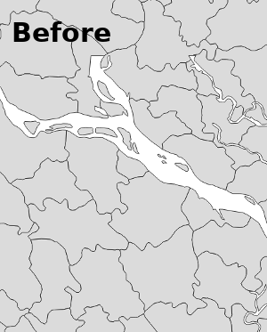

# Region Simplify

Use [RegionSimplify](README.md) to simplify your regions like [that](resources/ex_lbl.gif?raw=true):

 

**NEW:** Multi processor computation + support for SHP, GeoPackage and GeoJSON formats.

## Quick start

1. Download [regionsimplify.zip](releases/regionsimplify-1.4.0.zip?raw=true) and unzip somewhere.
2. Run: `java -jar RegionSimplify.jar -i pathTo/myRegions.gpkg` where `pathTo/myRegions.gpkg` is the path to the input regions. You can alternativelly edit and execute *RegionSimplify.bat* (or *RegionSimplify.sh* for Linux users).

## Usage

### Requirements

Java 1.9 or higher is required. The java version installed, if any, can be found with `java --version` command. Recent versions of Java can be installed from [here](https://www.java.com/).

### Input data

* Input data must be a set of polygonal or multipolygonal features with no overlap between them.
* [GeoPackage](https://www.geopackage.org/), [Shapefile](https://en.wikipedia.org/wiki/Shapefile) and [GeoJSON](https://geojson.org/) formats are supported. For other formats, use a converter such as [GDAL](http://www.gdal.org/) or [QGIS](https://www.qgis.org/).
* The projection of the input file must be specified. Both geographical and cartographic projections are supported.
* Some valid test datasets are provided in *test_data* folder.

### Input parameters

The help is displayed with `java -jar RegionSimplify.jar -h` command.

| Parameter | Required | Description | Default value |
| ------------- | ------------- |-------------| ------|
| -h | | Show the help message |  |
| -i, --inputFile *file* | * | Input file. The supported formats are GeoPackage (*.gpkg extension), SHP (*.shp extension) and GeoJSON (*.geojson extension). | |
| -o, --outputFile *file* | | Output file (format: GPKG, GeoJSON or SHP). | out.gpkg |
| -s, --scaleDenominator *double* || The scale denominator for the target data. For a simplification to scale 1:1'000'000, the value should be 1000000. For a correspondance between zoom level and scale, see [here](https://gis.stackexchange.com/questions/7430/what-ratio-scales-do-google-maps-zoom-levels-correspond-to). | 50000|
| -p, --parallel *int* || Set to 1 to use multiple processors in parallel. Set to 0 otherwise. | 1 |
| -inb, --roundNb *int* || Number of iterations of the process. A small value returns a result faster, while a high value returns better quality result. | 10 |
| -mcn, --maxCoordinatesNumber *int* || The maximum number of vertices of the input dataset. Above this value, the simplification will be applied automatically on a decomposition. See section below for more info. | 1000000 |
| -omcn, --objMaxCoordinateNumber *int* || The maximum number of vertices of each region dataset. Above this value, the simplification will be applied automatically on a decomposition of the input dataset. See section below for more info. | 1000 |

### Dealing with large datasets

[RegionSimplify](README.md) can handle large datasets thanks to an automatic partionning mechanism. The principle is to decompose recursivelly the input dataset if it is too large, apply the simplification to the parts (possibly in parallel), and finally recompose the results. The partitionning is based on a quadtree structure as illustrated on the image below.

To use [RegionSimplify](README.md) on large datasets, you should thus:
* Increase the memory allocated to the program with *Xmx* and *Xms* parameters, such as: `java -Xmx12g -Xms4g -jar RegionSimplify.jar -i pathTo/myRegions.shp`
* Ajust the parameters *-mcn* and *-omcn* described in the table above. Low value mean intensive decomposition but fast simplifications. High values mean little decomposition but potentially time-consuming simplifications.
* Use parallel computation, for multi processor machine. For that, ensure the parameter *-p* is set to *1* (which is the case by default).

## Showcase

[RegionSimplify](README.md) is used at [Eurostat-GISCO](http://ec.europa.eu/eurostat/web/gisco) for the production of [statistical and administrative unit datasets](http://ec.europa.eu/eurostat/web/gisco/geodata/reference-data/administrative-units-statistical-units) at different scales, such as [the NUTS dataset](http://ec.europa.eu/eurostat/web/gisco/geodata/reference-data/administrative-units-statistical-units/nuts). For more information, see [here](resources/gen_eurostat.pdf).

## Comparison with other simplification tools

Here are few comparison examples with [MapShaper](http://mapshaper.org/):
* [1:1M to 1:5M simplification](resources/comp/ms_5M.gif?raw=true)
* [1:1M to 1:10M simplification](resources/comp/ms_10M.gif?raw=true)

## Support and contribution

Feel free to [ask support](https://github.com/eurostat/EuroGen/issues/new), fork the project or simply star it (it's always a pleasure). The source code is currently stored as part of [JGiscoTools](https://github.com/eurostat/JGiscoTools) repository. It is mainly based on [GeoTools](http://www.geotools.org/) and [JTS Topology Suite](https://locationtech.github.io/jts/).
